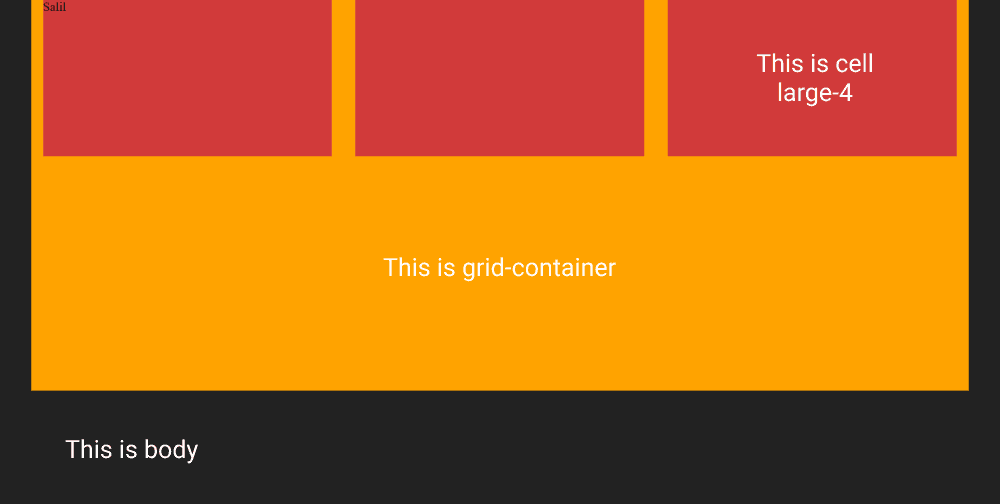
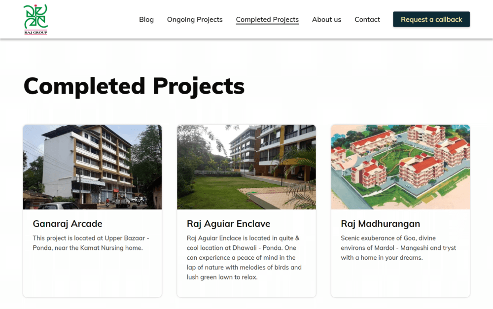

# product.css - Lightweight CSS Grid System for Web Development

<p align="left">
  <a href="http://foundation.zurb.com/">
    
  </a>
</p>

<p>
Product.css is a lightweight CSS framework based on <a href="https://foundation.zurb.com" target="_blank">Foundation CSS</a> framework.
</p>

[](https://cdn.jsdelivr.net/gh/salil-naik/product.css/v-2.0/product.min.css)


## Use From the CDN:

```html
<link href="https://cdn.jsdelivr.net/gh/salil-naik/product.css/v-2.0/product.min.css" rel="stylesheet" type="text/css" />
```

## Features

product.css is a lightweight css framework which helps in making websites responsive. It is a very light weight css framework, a cut down version of Foundation CSS framework.
Some of the key features of product.css are:

* Small footprint: product.min.css - 9 K
* A responsive grid with mobile friendly approach
* Perfect for website with less or no js functionalities
* Structure is same as Foundation's. No need to learn a new framework


## Example

```html
<div class="grid-container">
    <div class="grid-x">
        <div class="cell large-4 medium-2">
            <!-- Content-->
        </div>
        
        <div class="cell large-4 medium-2">
            <!-- Content-->
        </div>

        <div class="cell large-4 medium-2">
            <!-- Content-->
        </div>
    </div>
</div>
```

### Representation


<br><br>
<p>Example below shows the usage of the grid system</p>

